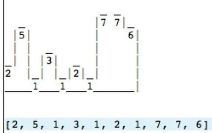
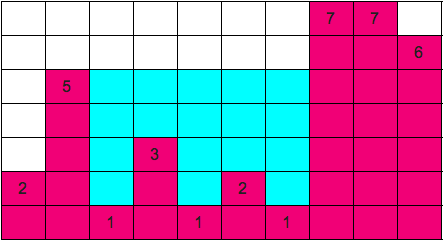

# Pleo challenge

We would like you to create a user interface using any framework of your choise that solves the following problem.

## The problem

In this challenge, you are given a vector of heights and these heights form a structure like shown in the following figure.
 

Vector : **[2, 5, 1, 3, 1, 2, 1, 7, 7, 6]**
 
It is now raining over the structure and the water starts flowing onto the cells.  The water in a cell always flows to the neighboring cell of least height - if it is not already occupied by water or a block. All the neighboring cells that drains into a sink are said to form a basin. 
 

 
Observe that the structure is thereby partitioned into basins. You need to determine the number of unit of water contained in all basins. In this example the input for this program is [2, 5, 1, 3, 1, 2, 1, 7, 7, 6] and the output is 17 units of water.

## The objective

The goal is to create an optimal algorithm that given any array will output the correct units of water. Please make a user interface to enter the values and visualize the solution.

## Instructions

Fork this repo with your solution. We want to see your progression through commits (so don’t commit the entire solution in 1 step). You sould also edit the README.md to explain your solution.

Solutions for the algorithmic part are possible to find online. Please be advised though that we do expect you to try and solve this without just googling the solution. In the end the most interesting thing is not whether you have the _absolute most optimal_ algorithm, but rather your thought process and work on how you arrived to your solution.

Happy hacking 😁!

## Solution

The solution is based in three basic concepts:
* Modelling the structure in a 2x2 Table
* Simulating rain event in the structure, 
* Counting water units in the basins of the structure

### Modelling the structure:

Parsing the user input generates a 2d table, where the number of columns is the length of the user-input array and the number of rows is the max number in the user-input array. The initial values for the table cells is 0.

The structure's cells can contain the following values: 
 * 0 if the cell is Empty
 * 1 if the cell is Block
 * 2 if the cell is Water

In order to map the user input we loop the table and set 1s in the cells that contain blocks. In the figure above, the resulting table looks like that:

|          |
|:--------:|
|0110000000|
|1110000000|
|1110000010|
|1110000010|
|1110001010|
|1110101011|
|1111111111|
 
 ### Simulating the rain event:
 
 When the rain happens, we fill the structure's cell with water row after row from the bottom to the top. Filling a row with water takes place if there is a basin, i.e. from left to right, this row has cells that follow the pattern:

> `(at_least_one_block, at_least_one_empty, at_least_one_block)` 

for at least one time in the row. Filling the cell with water, takes place only if the column does not have a hole in its bottom and if the cell is empty (i.e. not a block or water). 
 
 After the rain the structure above looks like this:
 
|          |
|:--------:|
|0110000000|
|1110000000|
|1112222210|
|1112222210|
|1112221210|
|1112121211|
|1111111111|
 
 
 ### Counting water units in the structure:
 
 Happens by loopping through the table and counting how many water (2) cells are present in the table.